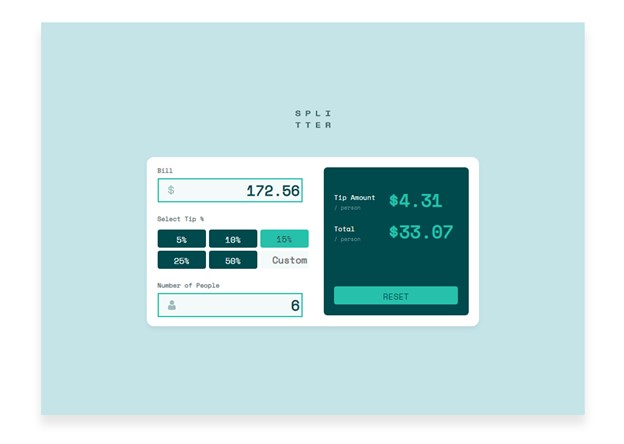

# Frontend Mentor - Tip calculator app solution

This is a solution to the [Tip calculator app challenge on Frontend Mentor](https://www.frontendmentor.io/challenges/tip-calculator-app-ugJNGbJUX). 

## Table of contents

- [Overview](#overview)
  - [The challenge](#the-challenge)
  - [Screenshot](#screenshot)
  - [Links](#links)
- [My process](#my-process)
  - [Built with](#built-with)
  - [What I learned](#what-i-learned)
  - [Continued development](#continued-development)
  - [Useful resources](#useful-resources)
- [Author](#author)

**Note: Delete this note and update the table of contents based on what sections you keep.**

## Overview

### The challenge

Users should be able to:

- View the optimal layout for the app depending on their device's screen size
- See hover states for all interactive elements on the page
- Calculate the correct tip and total cost of the bill per person

### Screenshot




### Links

- Solution URL: [Github](https://github.com/hdelgad3/tips_calculator)
- Live Site URL: [Calculator](https://tip-calculator-hector.netlify.app/)

## My process


### Built with

- Semantic HTML5 markup
- CSS custom properties
- Flexbox
- CSS Grid
- Mobile-first workflow
- Vanilla Javascript


### What I learned

I learned about CSS Grid and DOM manipulation. 

```css
.btnForm {
  display: grid;
  grid-template-areas:
    "title title ."
    "btn5 btn10 btn15"
    "btn25 btn50 custom";
  grid-gap: 5px;
  margin-bottom: 20px;
}
```
```js
people.addEventListener('input',(e)=>{
    let key = e.target.value;
    key = parseInt(key);
    if(key === 0){
        peopleError.style.visibility = 'visible';
        people.style.border = '2px solid red';
    }
    else{
        peopleError.style.visibility = 'hidden';
        people.style.border = '2px solid var(--primary-color)';
        calculatePeople(key);
    }
});
```


### Continued development

I want to keep practicing Javascript and  learn the React library when i'm satisfied with my Javascript skills in the future. Also, Tailwind CSS is a CSS framework I am interested in learning. The ultimate goal is to become a fullstack developer.  


### Useful resources

- [Mozilla JS Documents](https://developer.mozilla.org/en-US/docs/Web/JavaScript) - These Javascript documents are well typed and have helped me understand concepts like node lists and closures in better detail. 
- [CSS Grid Guide](https://css-tricks.com/snippets/css/complete-guide-grid/) - This resource has given me clear examples and visuals to grasp CSS Grid properties.


## Author

<!-- - Website - [Add your name here](https://www.your-site.com) -->
- Frontend Mentor - [@hdelgad3](https://www.frontendmentor.io/profile/hdelgad3)
- Twitter - [@Irllydo](https://twitter.com/Irllydo)


